# Лабораторная работа №6. Система контроля версий

Выполнил: студент гр. 4516 Клименко М. А.

## Цель работы

Изучение базовых возможностей системы управления версиями, опыт работы с Git API, опыт работы с локальным и удалённым репозиторием.

## Ход работы

### 1. Fork репозитория

Репозиторий https://github.com/Kurtyanik/LR6 скопирован в личное хранилище через кнопку Fork. При этом скопировалась только ветка master, поэтому ветка branch1 позже была получена из исходного репозитория через дополнительный remote upstream.

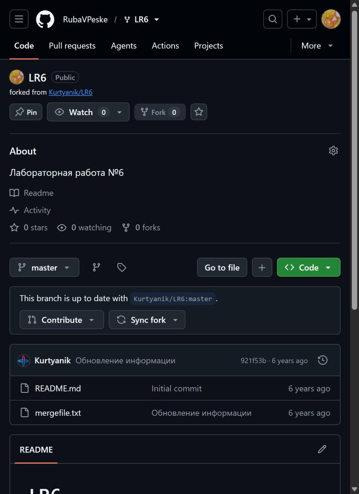

### 2. Установка и настройка Git

Git for Windows установлен через winget. В настройках клиента указаны имя пользователя в формате «Группа Фамилия И.О.» и email.

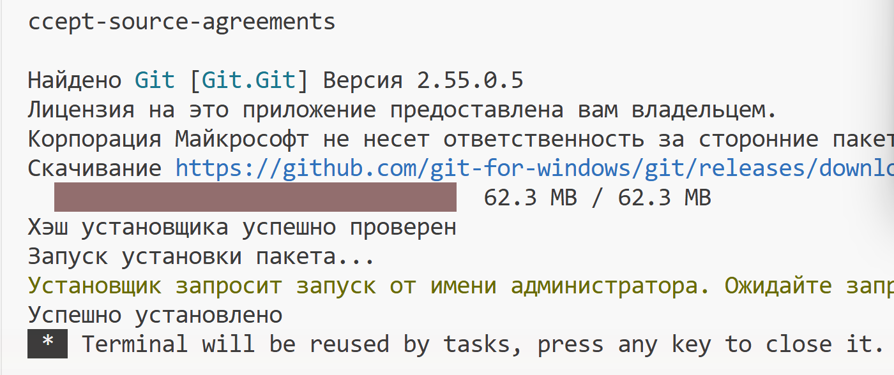

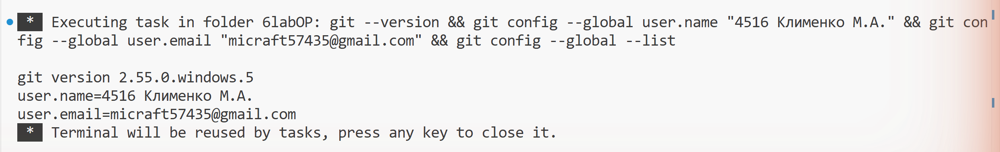

### 3. Клонирование и файл через интерфейс GitHub

Личный репозиторий склонирован на компьютер. Затем через веб-интерфейс GitHub в ветку master добавлен файл github_file.txt, и изменения подтянуты в локальный репозиторий командой git pull.

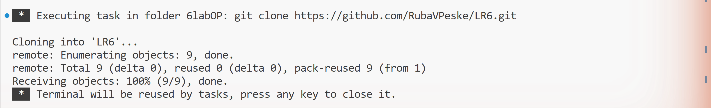

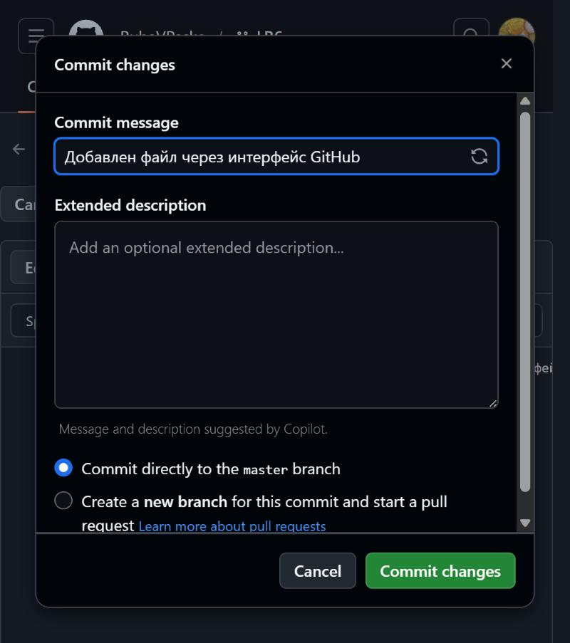

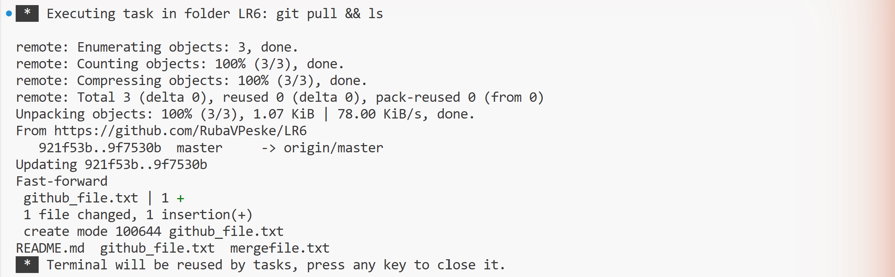

### 4. История веток и последние изменения

Ветка branch1 получена из upstream, для каждой ветки выведена история коммитов. Последние изменения просмотрены командой git show.

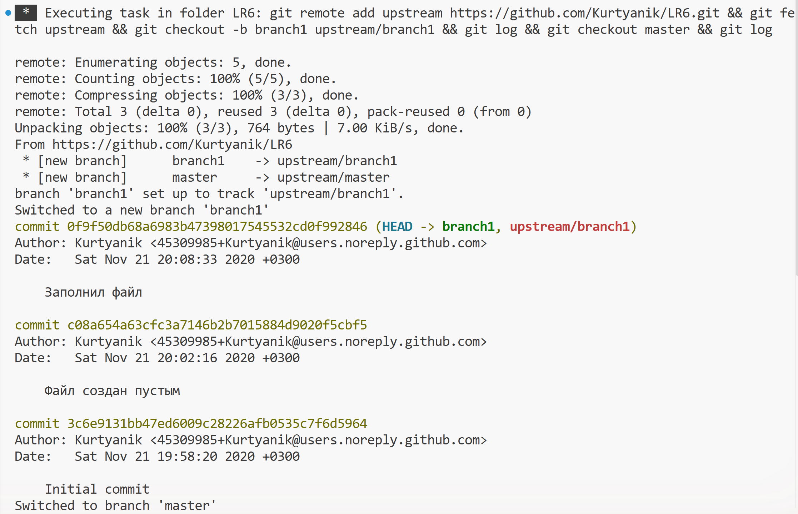

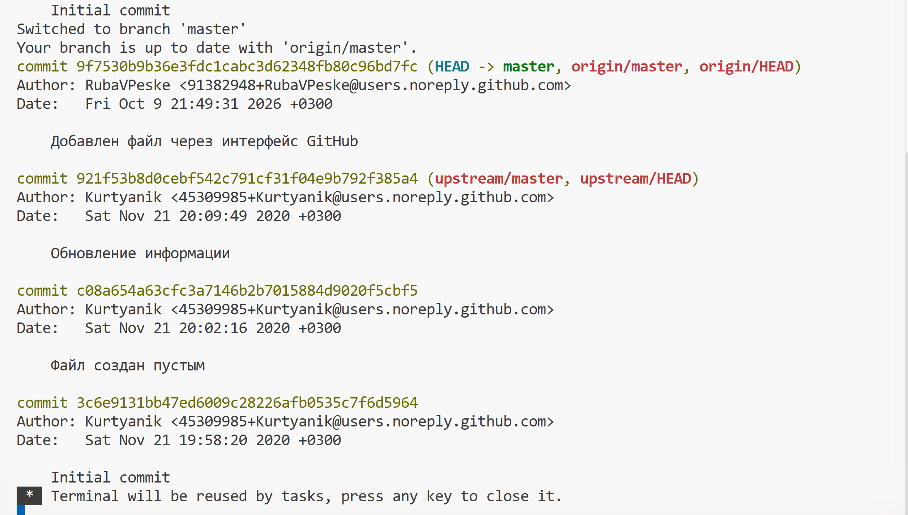

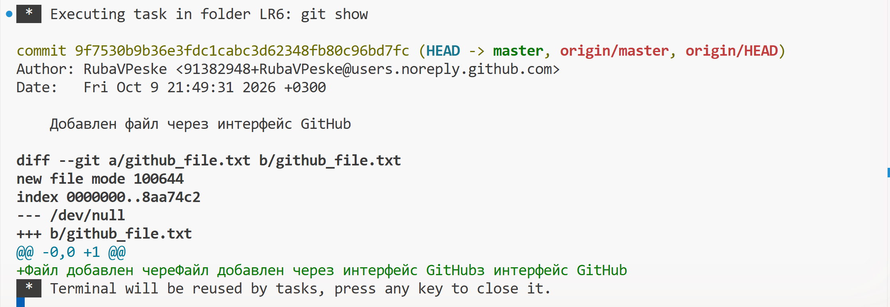

### 5. Слияние с конфликтом

При слиянии branch1 в master возник конфликт в файле mergefile.txt: обе ветки изменили одни и те же строки. Конфликт разрешён в редакторе VS Code кнопкой Accept Both Changes, после чего сделан коммит слияния. Побочная ветка branch1 удалена.

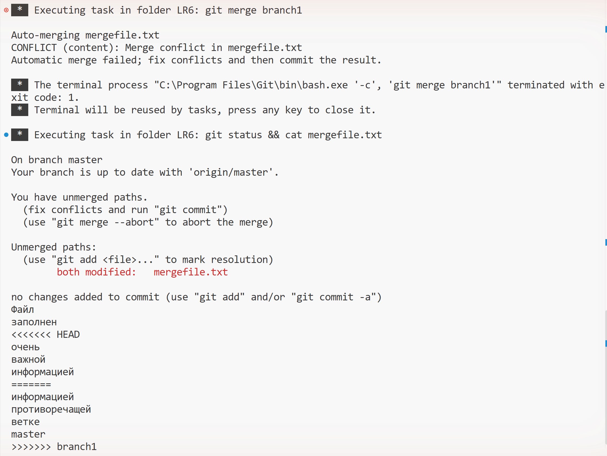

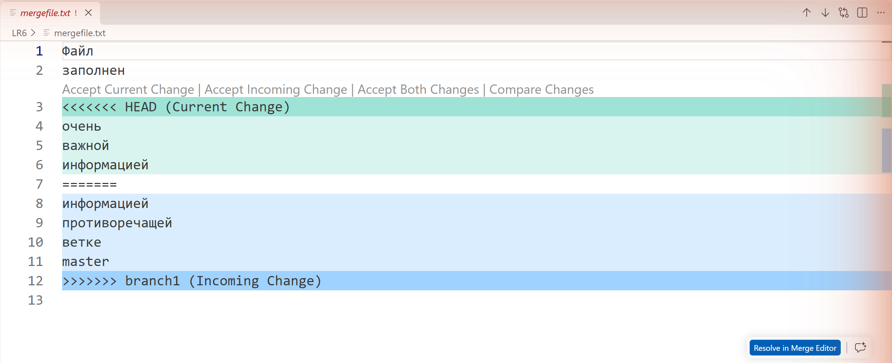

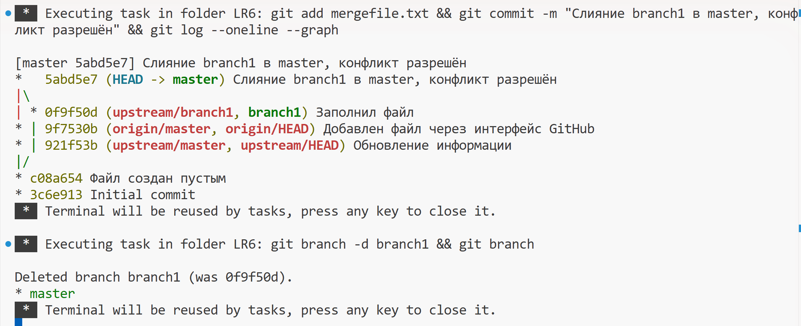

### 6. Коммиты и откат

В файл notes.txt трижды вносились изменения с отдельными коммитами. Последний коммит отменён командой git revert, которая создаёт новый коммит с обратными изменениями. Для отчёта создана ветка report.

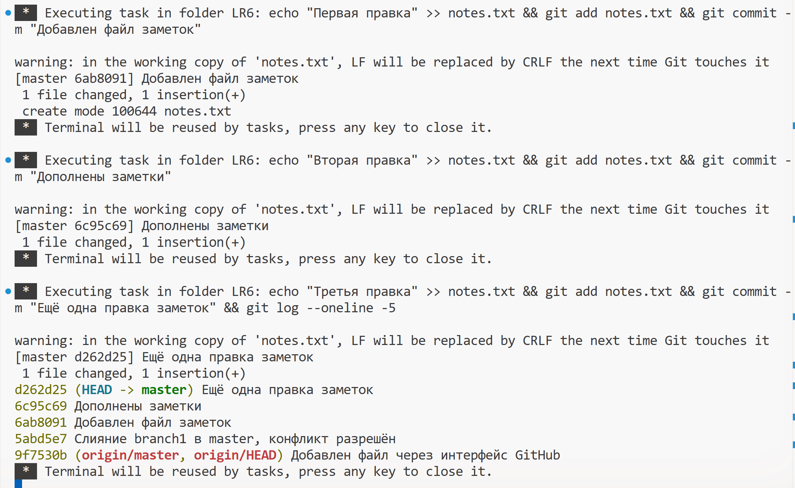

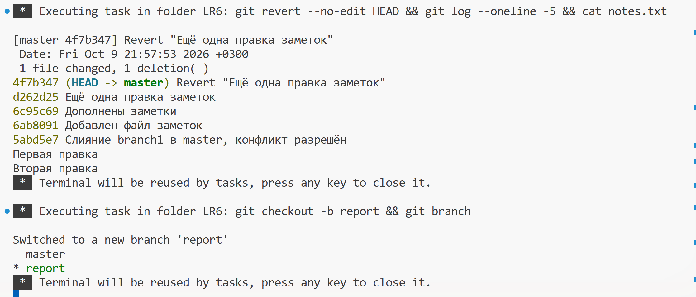

## Лог команд

```
winget install --id Git.Git -e --source winget
git --version
git config --global user.name "4516 Клименко М.А."
git config --global user.email "micraft57435@gmail.com"
git config --global --list
git clone https://github.com/RubaVPeske/LR6.git
git pull
git remote add upstream https://github.com/Kurtyanik/LR6.git
git fetch upstream
git checkout -b branch1 upstream/branch1
git log
git checkout master
git log
git show
git merge branch1
git status
git add mergefile.txt
git commit -m "Слияние branch1 в master, конфликт разрешён"
git log --oneline --graph
git branch -d branch1
echo "Первая правка" >> notes.txt
git add notes.txt
git commit -m "Добавлен файл заметок"
echo "Вторая правка" >> notes.txt
git add notes.txt
git commit -m "Дополнены заметки"
echo "Третья правка" >> notes.txt
git add notes.txt
git commit -m "Ещё одна правка заметок"
git log --oneline -5
git revert --no-edit HEAD
git checkout -b report
git add README.md
git commit -m "Отчёт: начало оформления"
git add README.md screenshots
git commit -m "Отчёт: добавлены снимки экрана"
git log --pretty=format:"%h %ad %an %s" --date=short
git add README.md
git commit -m "Отчёт: история операций, финальная фиксация"
git push --all origin
```

## История операций

Будет добавлена в конце работы.
